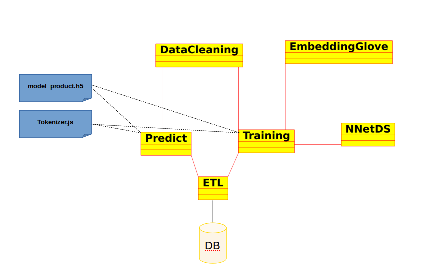

# Identifying the product in a user complaint.
* LSTM (tensorflow)
* Embedding (GLOVE)
* postgreSQL

```
$python main.py -h
usage: main.py [-h] [-p PREDICT] [-t] [-m [METHOD]]

Identifying the product in a user complaint.

optional arguments:
  -h, --help            show this help message and exit
  -p PREDICT, --predict PREDICT
                        Classify a text.
  -t, --train           Build the model.
  -m [METHOD], --method [METHOD]
                        Pruning method. Use with train.
```

## What's inside this folder
* **notebooks**
    * Identifying_the_product_in_a_user_complaint.ipynb | _new file_
* **artifacts**
    * model_products.h5 | _new file_
    * tokenized.json | _new file_
* **code**
    * data_cleaning.py | _new file_
    * embedding_glove.py  | _new file_
    * main.py | _new file_
    * net_data_structure.py | _new file_
    * predict.py | _new file_
    * training.py | _new file_
* **data**
    * complaints_companies.csv
    * complaints_users.csv
    * **glove.6B**
        * glove.6B.50d.txt | _new file_
    * issues.csv
    * products.csv
* **misc**
    * db_config.yaml
    * etl.py  | _modified_
    * README.md | _modified_
    * requirements.txt
    * schemas.yaml
* Challenge - ML Engineer - NLP.docx

## Software Architecture


### Identifying_the_product_in_a_user_complaint.ipynb
Jupyter notebook. Use this file to understand how the network is built and the reasoning behind it. 

### model_products.h5  and tokenized.json 
These files are created after the training phase from the class Training. model_products.h5 store the neural network weight whereas the tokenized.json stores the sequence of vectors of the corpus.

### data_cleaning.py
This file implements the class **DataCleaning** . It does the text preprocessing in following steps:
* Replace contractions
* Remove not ascii code
* Lowercase
* Remove punctuation
* Manage currency, numbers and date (obfuscate)
```
dc = DataCleaning()
dc.normalize("text raw")
```
### embedding_glove.py 
This file implements the class **EmbeddingGlove**. It creates the embedding matrix with the well-know Glove vectorial space. The embedding matrix is passed as argument to the Embedding layer of the NN. It is used in the Training class.
```
e_m = EmbeddingGlove( MAX_WORDS, 
                      MAX_SEQ_LENGTH,
                      GLOV_EMBEDDING_DIM,
                      word_index)
e_m.get_matrix()
```

### main.py
Entry point file.
* To run the training > python main.py [-t|--training ] [ (optional)-m|--method [mean|median|quartile]] 
* To run the prediction > python main.py [-p|--predict "complaining product text"]

## net_data_structure.py
This file implements the class **NNetDS** . This class is a data structure that permit to share parameters of the neural network inside of the Training class. 

## predict.py
This file implements the class **Prediction**. Giving a text, it predicts a product. This class uses the files model_products.h5 and tokenizer.json stored in the artifacts folder. This class is used in main.py.
```
p = Predict()
p.get_product_name("message 1") -> (Prod_1,Sub_prod_1)
...
p.get_product_name("message 2")-> (Prod_1,Sub_prod_2)
```
## training.py
This file implements the class **Training**. It builds the neural network and trains the model. This class produces the files model_product.h5 and tokenizer.json used by Prediction class. The structure of the network is implemented into  _build_tf_model(self)_ method. The object of this class accepts the parameter _pruning_method_. This parameter permits to do clean the dataset reducing the number of products removing products with few comments.
This class is used in main.py.
```
pruning_method = "mean" # mean| median | quartile| None
Training(pruning_method)
```

# schemas.yaml
I've created a new table to map the product_id with a new_product_id. This table is created during the training phase and used during the prediction phase.
```
name: new_product_id_mapping
  size: small
  columns: ['product_id', 'new_product_id']
  schema: |
    product_id integer  primary key,
    new_product_id integer not null
```

# etl.py
I've introduced three methods:
* **insert_new_product_id_table**: this method inserts a new row into the table new_product_id_mapping. Each row has two values a _product_id_ and the _new_product_id_.
```
def insert_new_product_id_table(self, df):
        with DBConnection(self.db_config_path) as connection:
            cur = connection.cursor()
            try:
                for i in df.index:
                    query = "Insert into new_product_id_mapping ( product_id,new_product_id) values ( {} , {}) ".format(df['product_id'][i],df['new_product_id'][i])
                    cur.execute(query)
                connection.commit()
            except Exception as e:
                logging.error(f"Error during insert new product id", e)
                raise
            connection.close()
```
* **select_complaints_users_from_db**: this method is used to get the complaints_users dataset from the DB. Only the columns _complaint_id , complaint_text, product_id_ are extracted.
```
def select_complaints_users_from_db(self):
         with DBConnection(self.db_config_path) as connection:
            cur = connection.cursor()
            query = "select complaint_id , complaint_text, product_id from complaints_users"
            cur.execute(query)
            result = cur.fetchall()
            connection.commit()
            connection.close()
            return result
```
* **select_product_name**: this method returns the main_product and sub_product from a new_product_id with nested select. (We can replace this sql query using the JOIN) 
```
    def select_product_name(self,new_id):
        with DBConnection(self.db_config_path) as connection:
            cur = connection.cursor()
            query = "select main_product , sub_product from products where product_id = (select product_id from new_product_id_mapping where new_product_id = {})".format(new_id)
            cur.execute(query)
            result = cur.fetchone()
            connection.commit()
            connection.close()
            return result
```
# Tips
* postgress:11 => I forced -e POSTGRES_HOST_AUTH_METHOD=trust to run postgress without password
* install psycopg2 my ubuntu 18.04 => install `sudo apt install libpq-dev python3-dev` before to install `pip install psycopg2==2.8.4`